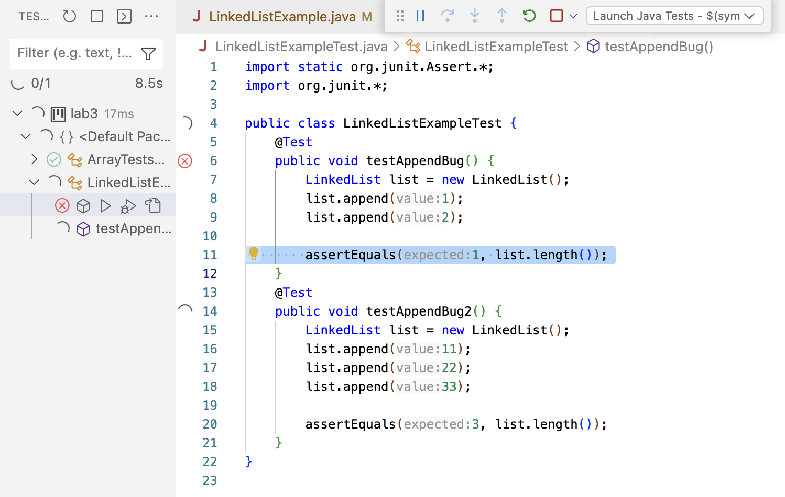
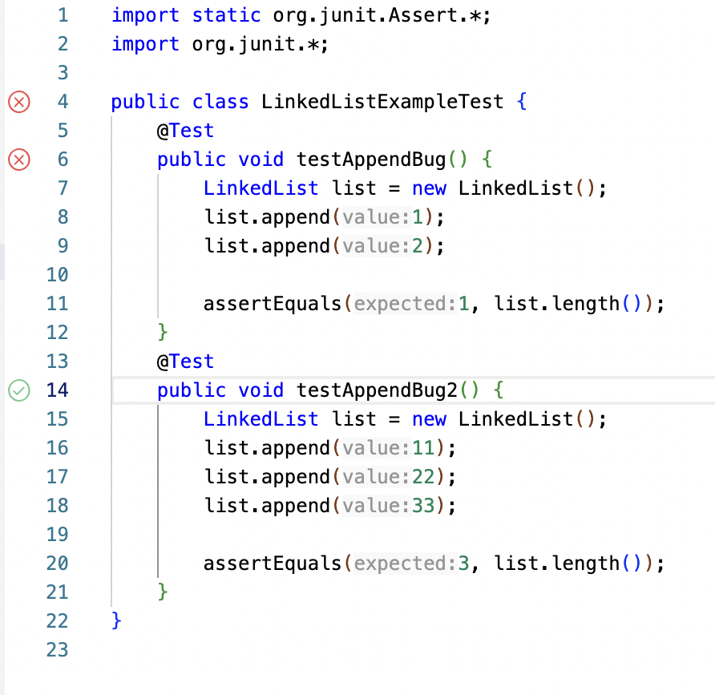
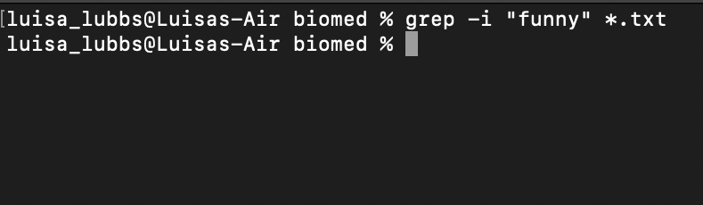
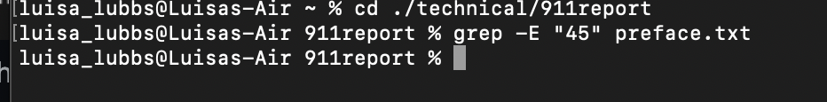

# *Lab Report #3*

## Part 1: Bugs
The bug I have chosen to explore from Week 4's lab is the bug in the LinkedListExample.java file, under `class LinkedList` pertaining to the `append` method.
- A failure inducing input is as follows:
```
@Test
public void testAppendBug() {
  LinkedList list = new LinkedList();
  list.append(1);
  list.append(2);

  assertEquals(1, list.length());
}
```
- An input that doesn't produce an error is:
```
@Test
public void testAppendBug2() {
  LinkedList list = new LinkedList();
  list.append(11);
  list.append(22);
  list.append(33);

  assertEquals(3, list.length());
}
```
- The symptom for this buggy code are the following:   After the code was fixed, one test passes and the other failed; before the fix one failed and the other took too long to run, hence the buggy code.
- Bug before:
```
public void append(int value) {
  ---PREVIOUS CODE---
  while(n.next != null) {
    n = n.next;
    n.next = new Node(value, null);
  }
}
```
- Bug after fix:
```
public void append(int value) {
  ---PREVIOUS CODE---
  while(n.next != null) {
    n = n.next;
  }
  n.next = new Node(value, null);
}
```
-  This fix addressed the issue becaue the `while` loop in the `append` method was iterating through the list while `n.next` was not null, but it continued to assign `next` to `n` and a new node with that value would be added to the list. So it kept iterating over `n` but never reached the end of that list because it kept pointing to `n` with no change.

## Part 2: Researching Commands
The command that I want to explore is `grep`.

One of the commands that it has is `-i` which ignores case distinctions when matching patterns. 
- One example of using the `-i` is:  Here, I input `grep -i "doctor" *.txt` to search through all the `txt` files in the biomed folder for the word "doctor," regardless of its case. It then returns all the files that contain the given word. This could be useful when you want to search for a certain word in files, but are unsure of its case sensitivity and its variations.
- Another example of the `-i` command is  In this example, my input was `grep -i "funny" *.txt" while still in the biomed folder inside the ./technical directory. This example demonstrates how when a word isn't present in any of the files, nothing will be returned. This is helpful as it demonstrates that there are no occurances of a certain word or patters in the files that we are searching through. 

Another command used with `grep` is `-v` which prints out the lines that do not match the pattern we are searching for. 
- One example of `-v` in use is:  For this example, my input was `grep -v "government" AP_LawSchoolDebts.txt` where it got rid of lines that didn't contain the word "government" in this given txt file. It could be useful to filter out different words or patterns that we don't want present in our files.
- Another example using `-v` is:  Where the input for this command was `grep -v "school" AP_LawSchoolDebts.txt` and as you can see, words that matched my input, "school," were eliminated from this given txt file. Again, this could be useful when we want to sort out a word that we don't want in our search. 

The command `-E` is used to treat patterns as extended regular expressions. 
- One example of this in use is:  For this example, my input was `grep -E "report|President" preface.txt` where I was searching for both of the given words in this specific text file. This could be useful because ERE gives a flexible syntax that users can search through. 
- Another example of using this command is  Where my input was `grep -E "45" preface.txt`. Obviously, there was no given output because there are no instances where the input is present, hence there is nothing to return. This is not to say that this command isn't useful, its just that in this given file there are no distinct characters that the command can really filter through. 

A final command that I found interesting to use is `-C n` which is used when we want to print searched lines and a certain amount of lines after before the result. 
- An example of this command in use is:  My input was `grep -C 4 "law" preface.txt` where I was displaying 2 paragraphs of context from this text file with my given input, "law." The two given outputs are the lines beginning with "To" and "Our" as they contain the word I gave in the command line. This is useful because it made it easier to filter through all the text of this file and find the 2 sentences with the word I wanted to find.
- The other example of using this command is  This time my input was `grep -C 1 "United" preface.txt` where I was filtering through all the sentences with the word "United." My output was 3 distinct paragraphs that contained my given output. Again, this is useful as it sorts through all the lines in my text file and it gives my output in way that is easy to digest as a user. 

I got all of this information and understanding of the different commands from this website: https://www.geeksforgeeks.org/grep-command-in-unixlinux/
