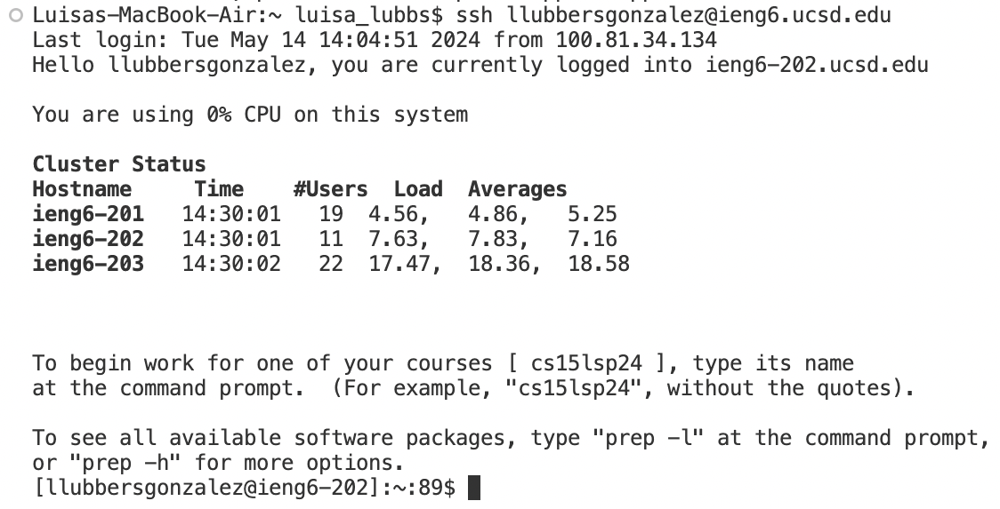
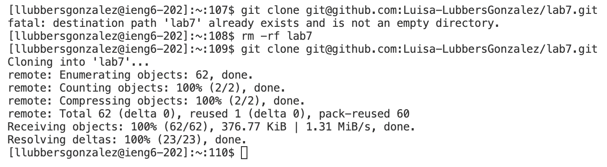
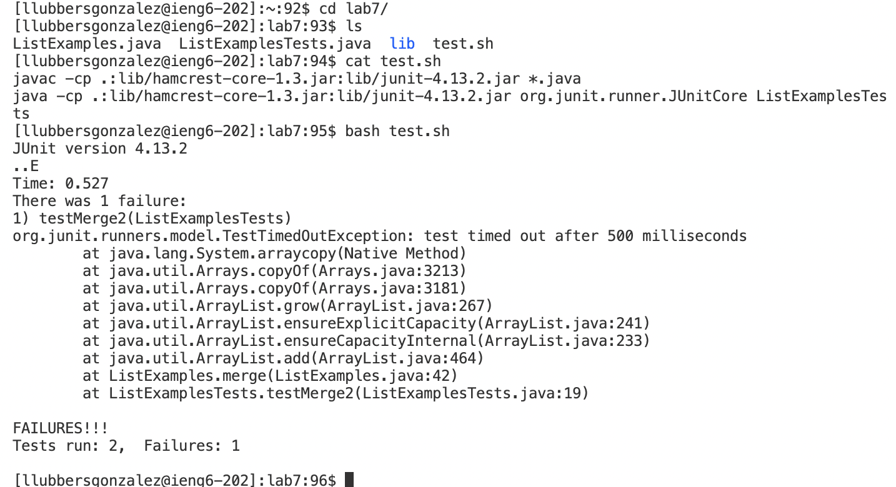
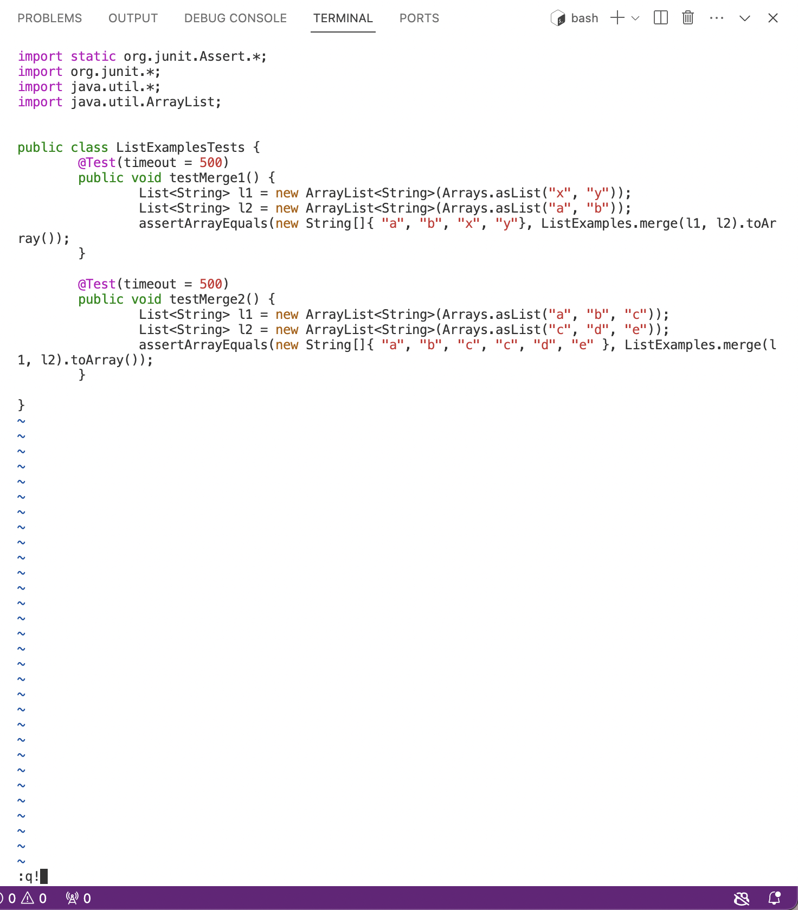
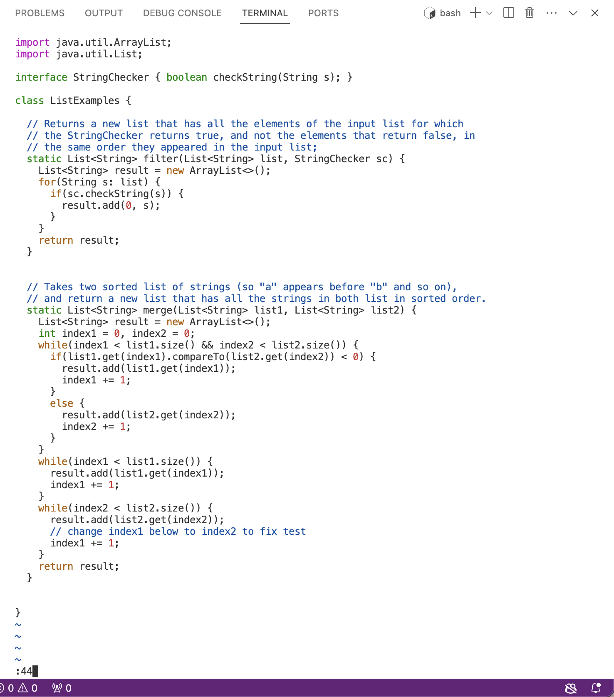
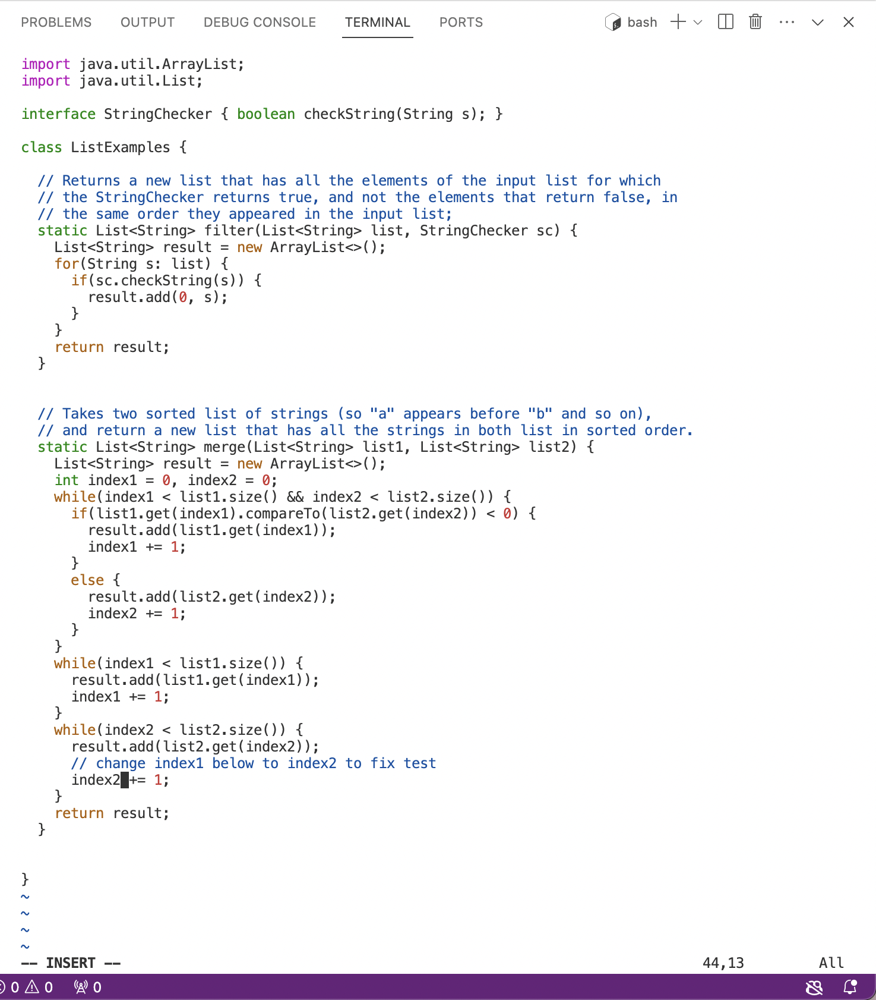
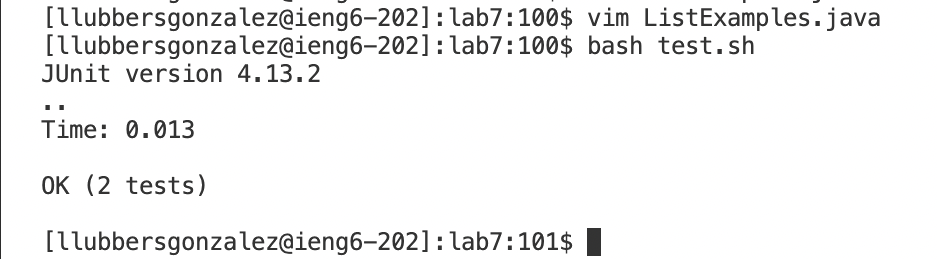
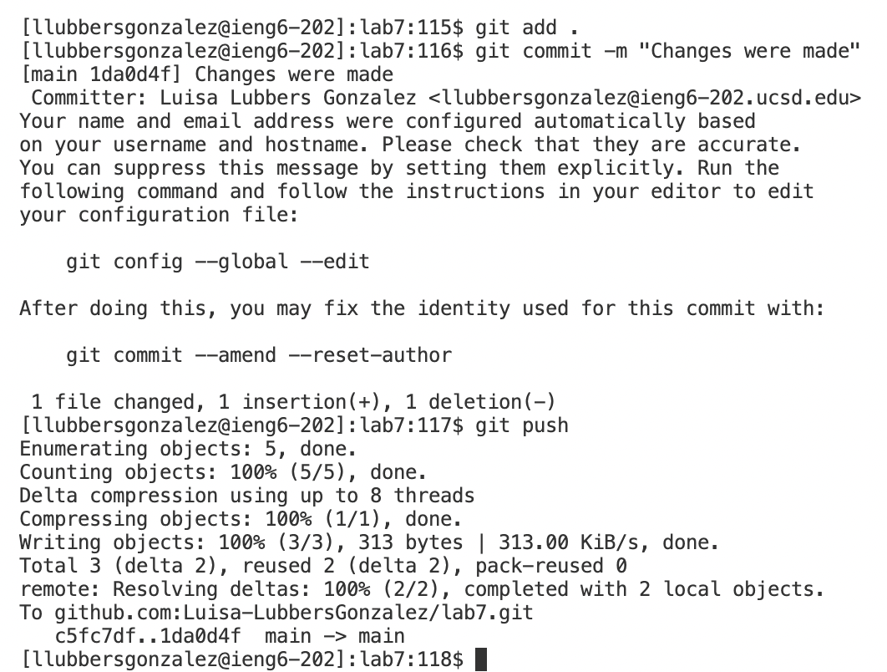
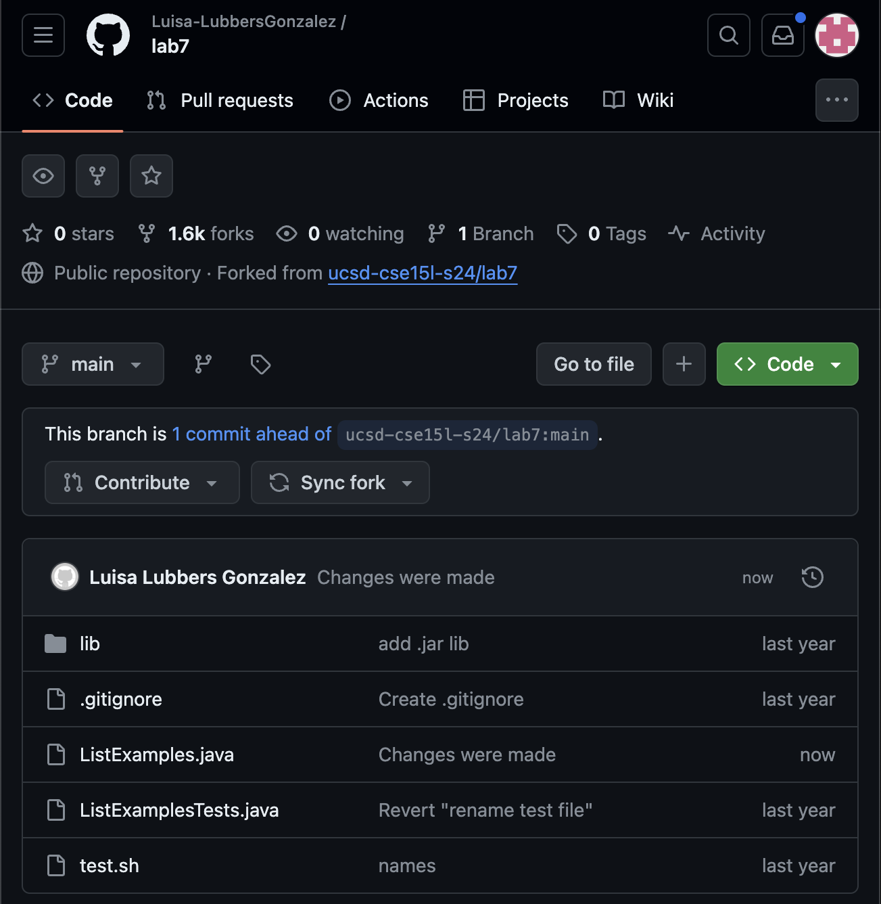

# *Lab Report #4*

## VIM Steps 4-9
For Step 4, the keys pressed were: `ssh llubbersgonzalez@ieng6.ucsd.edu<ENTER>`
This was just me logging onto ieng6 to be able to complete the rest of the lab/steps 

For Step 5: the keys were: `git clone <CMD> V<ENTER>`, `rm -rf lab7<ENTER>`, `<up><up><ENTER>`
- I pasted the ssh link that I had gotten from my forked repository of Lab 7, then I had to delete the previouly clonned repo using `rm` because I had practiced the steps before. Then I just went up twice to access the `git clone` I had used before in my history

For Step 6, the keys used were: `cd lab7/<ENTER>`, `ls<ENTER>`, `cat tesh.sh<ENTER>`, `bash test.sh<ENTER>`
- I `cd`d into the necessary directory, listed all the file present, `cat`ed test.sh to make sure that the tests look ok and had no bugs, and then ran the tests with `bash`

For Step 7, the keys were: `vim ListExamplesTest.java<ENTER>`, `:q!<ENTER>`, `vim ListExamples.java<ENTER>`, `:44<ENTER>`, `i <right><right><right><right><right><right><BACKSPACE> 2 <ESC>`, `:wq<ENTER>`, `<up><ENTER>`, `:q!<ENTER>`
- This step was quite long. I started by accessing the testers using Vim to verify that the error wasn't in the testers, and it wasn't. I then exited the file without saving any changes (because none were made) and accessed ListExamples with vim. I recognized the error in the file was on line 44, where it needed to update index2 so I went to that line. I entered edit mode with `i` and then proceded to the part that needed to be changed (1 to a 2) and hit `<ESC>` to get out of insert mode. I saved my changes in the file with `:wq` and then accessed the file again, going back once in my history, and ensured that the save was made. I exited the file without editing anything again using `:q!`
   

For Step 8, my keys were: `<up><up><up><ENTER>`
- This was to access the previous `bash` call I had made previously when initially running the tests. This time, they all passed!

For the final step, 9, the keys were: `git add<SPACE>.<ENTER>`, `git commit -m "Changed were made"<ENTER>`, `git push <ENTER>`
- I used the following git commands to commit and push the changes that I had made to these file to the forked repo that I had for this Lab. I included a photo of my forked repo once I had ran all my `git` commands
 
