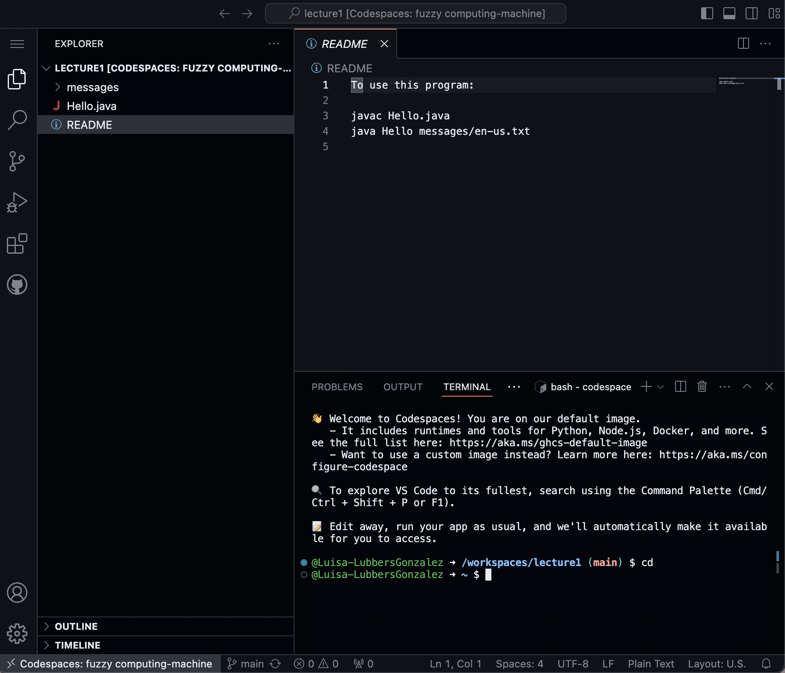
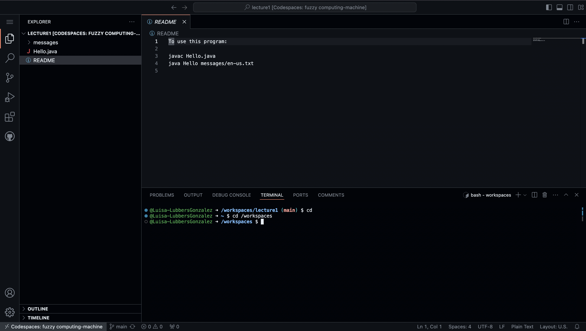
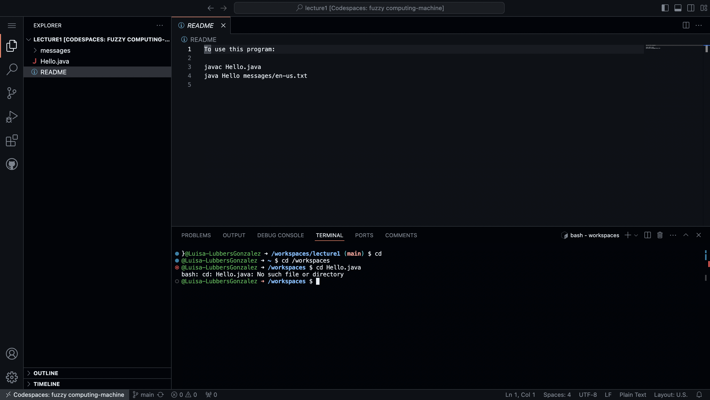
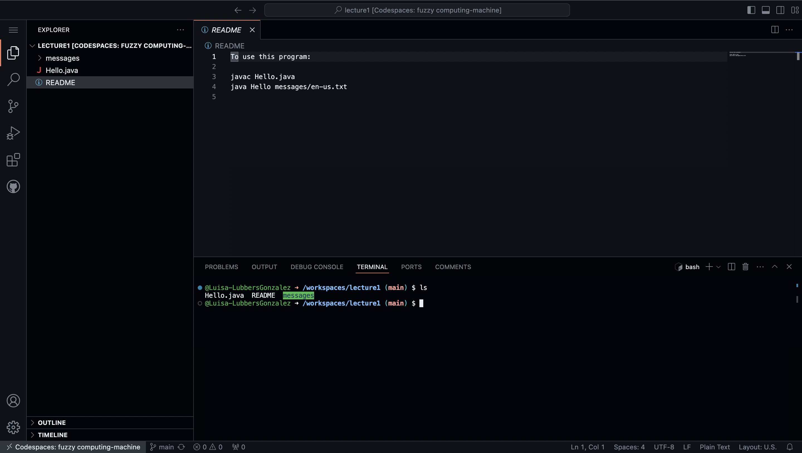
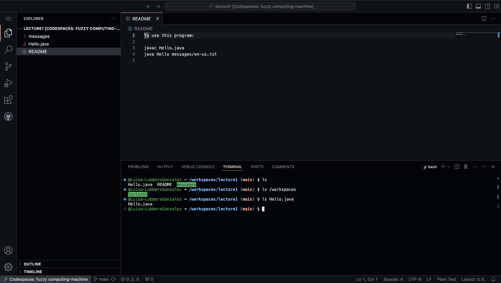
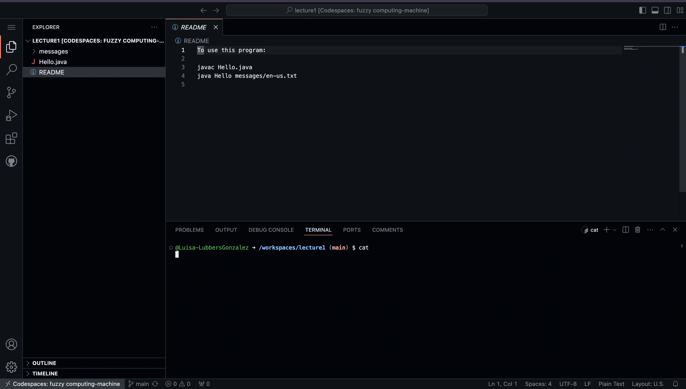
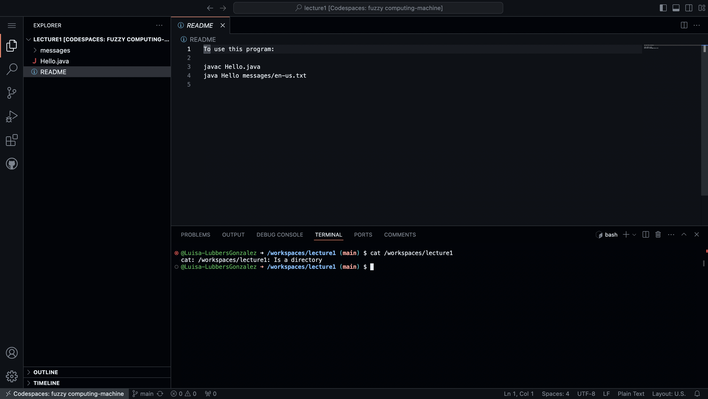
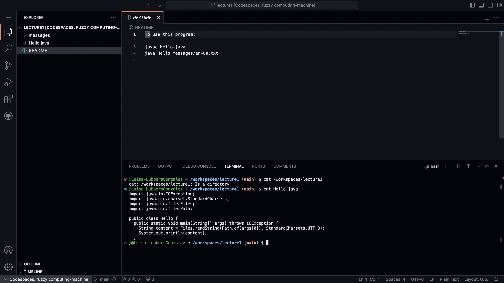

# *Lab Report #1*

## The `cd` Command
- For the first example, giving no arguments, the absolute path to the working directory right before the command was run was `/workspaces/lecture1`. The output of this command takes us to the home directory, as indicated by the `~`. It isn't an error because the command did what it should have. It took us to our home directory, as represented by the tilde.

- For the second example, this time giving the command  `cd /workspaces`, the absoute path of the directory before execution was `/workspaces/lecture1`. The output I got was then `/workspaces $`, demonstrating that the command did its job. I asked it to take me to workspaces, and it did. This isn't an error because the command did as it should and we do have a directory named `workspaces`.

- For the final example, this time giving the command `cd Hello.java`, the absolute path of the directory was `/workspaces` as it was where I was from the previous example. The message that I recieved was an error, which stated `cd: Hello.java: No such file or directory`. This specific output is an error because cd is used when we want to change our directory, and because `Hello.java` is a file, we can't change to it.

## The `ls` Command
- For the first example, with no input, the absolute path of the working directory is `/workspaces/lecture1` before any execution. The output that I got was `Hello.java` `README` and `messages`. I got this because ls listed all the files and folders that are currently in the diresctory `lecture1`. This produced no error because there were contents to be listed in `lecture1`.

- For the second example, using the input `/workspaces`, the absolute path of the directory is still `/workspaces/lecture1` because I didn't change my working directory from the previous example. My output this time was only `lecture1`; this is because it listed the one file that is in workspaces. This isn't an error as well because the command did it's job and it listed what was in the given path.

- For the final example, using the input `Hello.java`, the absolute path of my directory remains `/workspaces/lecture1` because I didn't use any other command to change it from before. The output that I got for this was simply `Hello.java`. This is because it is a file and there are no contents to be listed. While there are no contents to be listed, it doesn't return an error, but rather just the file name.

## The `cat` Command
- For the first example, using the command with no arguments, the absolute path of the working directory is `/workspaces/lecture1`. The output when using this command is nothing. It produced no error nor output. This is because cat is used to print the contents of the given file, and because I didn't give it any inputs, it didn't have to give an output.

- For the second example, using the input `/workspaces/lecture 1`, the absolute path of the working directory remains `/workspaces/lecture1` because I didn't do anything to change it. The output from this is an error message which says `cat: /workspaces/lecture1: Is a directory`. This occured because cat will produce an output when it's given a file, not a path, therefore this command doesn't work for these arguments. 

- For the third example, using the input `Hello.java`, the absolute path of the working directory is still `/workspaces/lecture1`. The given output of this code is provided in the photo. The reason for this output is because cat did its job: it printed the contents of the file `Hello.java`. No error message was produced as it did its job.

