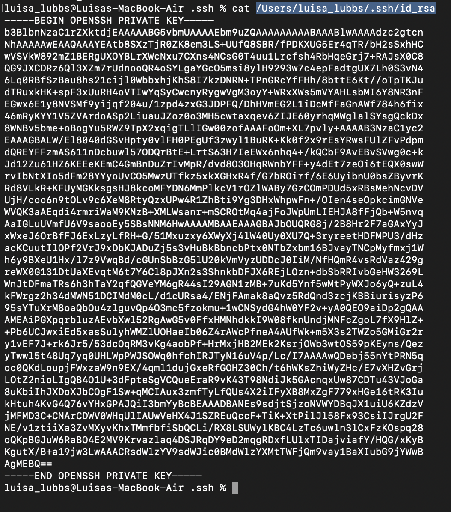
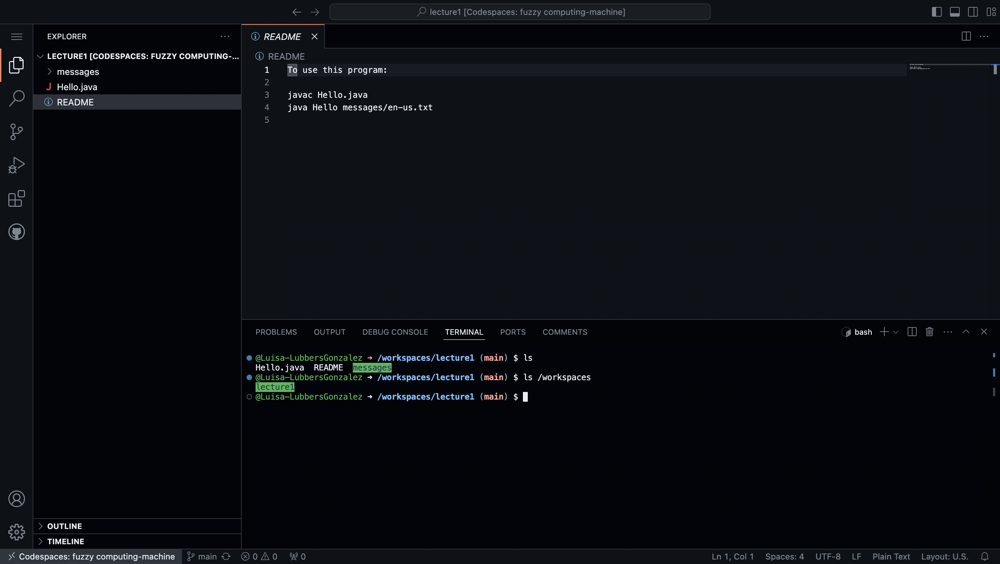
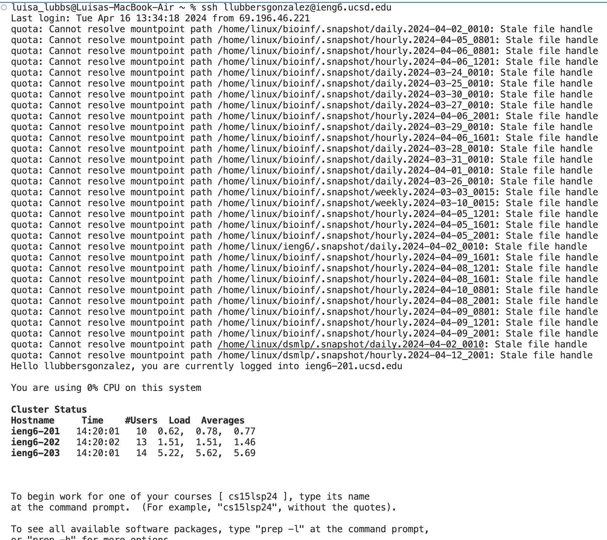

# *Lab Report #2*

## Part 1: `ChatServer`

## Part 2: Executing different commands
- Here is a screenshot of my terminal on my computer, accessing `.ssh` and looking at my *private* key to connect into `ieng6`. 

- Here is my accessing the *public* key that is stored in the `ieng6` machine with an absolute path. 

- Here, I logged into my `ieng6` account without having to input a password or give any additional information. This is because during lab 3, we created a key that memorizes us every time that we log into the server now .

## Part 3: Something I learned
These past 2 labs have been really informative and they have truly been fun to participate in and interact with. Something specific that I learned from Lab 3 is that you can remotely connect to the `ieng6` server without even opening up a terminal and connecting that way. Using just VSCode and connecting to the server using Remote Explorer was something new to me and interesting to work out in lab. I look forward to continuing to explore how we can further use that as the course continues. 
